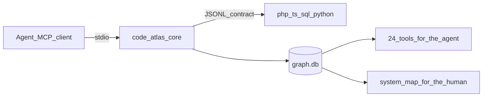

# Would I use code-atlas on an agent-built product team?

**Yes, with a narrow job description.** I would install it on the large, inherited, multi-language repos my agents actually get lost in. I would not install it on every greenfield service, and I would not let it become the default “understand the code” tool.

That is not a polite hedge. The project already measured the founding claim and **refuted it**: native grep+Read was 5/5 correct; the index arm was 3 correct / 1 partial / 1 wrong cause, and the agent reached for the graph in only **19%** of calls ([`docs/PLAN.md`](docs/PLAN.md) §19). What survived that measurement is still worth buying — just not the thing the README’s first sentence used to sell.

---

## What I now believe this system is

Two products, one SQLite graph. Stated only in [`docs/PLAN.md`](docs/PLAN.md) §1:

- **Pillar 1 (Graph)** — resolved relationships for an agent: who calls this, what implements that, what breaks if this file changes. A wrong answer is not an acceptable failure; silence is.
- **Pillar 2 (Onboarding)** — the same graph rendered for a human who is supervising the agent or presenting the project. The map is not a second pipeline.

Runtime is one language-agnostic core ([`code_atlas/main.py`](code_atlas/main.py), [`indexer.py`](code_atlas/indexer.py), [`resolver.py`](code_atlas/resolver.py), [`store.py`](code_atlas/store.py)) talking JSONL to per-language adapters. PHP, TypeScript/JavaScript, T-SQL, and Python are shipped. C# is deferred. 24 MCP tools, no edit/rename, no LLM in the core.

The architectural bets I would copy even if I never installed the server:

- **One seam, no registry.** Languages change; everything else is YAGNI. Adapter #2 landed with an empty core diff.
- **Standard over sample.** Adapters encode the language spec, never a repo’s framework names.
- **Honesty as the product.** Every empty result has a `reason`; every page has `total_count` / `truncated`; every edge has `RESOLVED | HEURISTIC | DYNAMIC`; a better route is a real tool name in `try_instead` ([`docs/design/payload.md`](docs/design/payload.md)).
- **Deterministic graph.** LLM prose is injected outside `code_atlas/` and off by default.

Those are the reasons I trust this more than a “repo map” that hallucinates structure.

---

## The job I would actually hire it for

I would use it for questions **text search cannot produce a second count for**:

| I would ask code-atlas | I would still use grep / Read / LSP |
|---|---|
| Who calls `Foo::bar`, at which tier? | Find a string, a comment, a config key |
| What implements this interface? | In-buffer jump-to-def while editing |
| What is the blast radius of this file? | “How does this mechanism work?” |
| Which modules does that change reach? | Small file the agent just wrote |
| Is this architectural rule still true? | Cross-language “which JS file hits which PHP action” without rules |
| Show me the layers / hubs / mirrors | A curated reading syllabus (measured wrong) |

The sample-tier win is real on **relation** queries: ~69× fewer tokens than grep-and-read on pinned PHP repos, 8/8 correct, recall 1.0, precision 1.0 ([`docs/runbooks/tokens-to-answer.md`](docs/runbooks/tokens-to-answer.md)). Parallel agents cost ~70 MB each against a 925 MB index that is never mmapped ([`docs/runbooks/parallel-agents.md`](docs/runbooks/parallel-agents.md)). That is the operational reason a multi-agent team should care: the alternative (resident LSP per worktree) already OOM’d a field session at ~5.6 GB each.

---

## When I would install it

I would wire MCP + the generated skill ([`contrib/skill/SKILL.md`](contrib/skill/SKILL.md)) on a repo if **all** of these are true:

1. The agent did not write the tree (or wrote only a slice of a much older tree).
2. The tree is large enough that “open the 26 grep hits” is the actual cost — roughly thousands of files, not a 40-file service.
3. The languages in play are PHP, TS/JS, T-SQL, or Python — and I am willing to treat PHP as the deep one and Python as the shallow one.
4. Someone will run `get_index_status` → `build_or_update_index` once, commit `.code-atlas.toml`, and install the opt-in edit/checkout hooks. An index the agent forgets to refresh is a confident lie.

I would also generate the Pillar 2 map once (`generate_onboarding`) and commit `docs/onboarding/`. That is the cheaper half for a human reviewing agent PRs: layers, crossings, hubs, capability table, signed `impact` claims.

## When I would not

- **Greenfield Python/TS products the agents are writing this week.** Search speed is not the product; the founding benchmark already lost that race. The agent already has the files in context.
- **C# / .NET shops.** Ticket 021 is deferred. No graph is worse than a graph that pretends.
- **“How does this control flow work?” as the primary question.** Ticket [074](docs/tasks/074_does-the-index-harm-mechanism-questions.md) is still deferred: one mechanism cell was **right when the index was denied and wrong when it was granted**. Ticket 067 showed a fully correct 23-of-23 `find_callers` page that still steered the agent off `src/` because page 1 was the wrong subtree. A cheap, correct, unrepresentative page terminates the reasoning that would have reached the truth.
- **Python call graphs as gospel.** After the local type table (227), pinned Flask still has **82.2% HEURISTIC `CALLS`**. PHP after its type table is 1–4%. I would use Python `search_symbol` / `read_symbol` / `architecture_overview`; I would not let `find_callers` close a blast-radius claim.
- **Cross-language dispatch without paying for rules.** PHP string → SQL proc and JS → PHP file are HEURISTIC `keyed_calls` or unmodelled. `CA_INDIRECTION_RULES` is data, off by default, and that is the honest price.
- **Expecting the agent to discover the tools.** Fit is the binding constraint. Ticket 200 is still `blocked` on a recognition probe. Descriptions cannot make an agent open a tool list it never looks at.

---

## How I would roll it out on this kind of team

Not “add 24 tools and hope.” A three-step adoption, in this order:

1. **Harness, not heroics.** One `.mcp.json` via `scripts/setup.py`, `CA_<LANG>_CMD` for every language the repo actually contains, `CA_ENTRY_POINTS` / `CA_STUB_ROOTS` set so orphans and reachability refuse instead of guessing. Install the skill by hand. Offer the hooks; do not let the server write editor settings (the project’s own posture, and I agree).
2. **A short standing prompt, not a second skill.** `get_index_status` first. Relation questions go to `find_callers` / `find_references` / `find_implementations` / `impact`. Read `reason`, `authoritative`, `truncated`, and `try_instead` as part of the answer. Never treat `results: []` as “does not exist.” Keep grep as the contradiction check — that is how the one cell the index won was actually won.
3. **Supervise with the map, not with more tools.** Commit the onboarding artifact. Use `check_architecture_rules` and signed `impact` claims on PRs. Do not add tools to close the 19% adoption gap; the decision log already says that does not work.

I would measure the roll-out the way this repo already learned to: **did the agent ask the graph on the questions only the graph can answer**, not “did tokens go down.” Ticket 046 already showed the ratio can move 0.02% while the information doubles.

---

## Architect’s bottom line

code-atlas is the first code-intelligence MCP I have seen that treats **calibrated silence** as a feature and has the field scars to prove why. I would use it.

I would use it as an **evidence layer** next to the agent’s native Read/Grep/LSP — on large PHP-or-mixed enterprise trees, for caller/implementor/impact questions, and for a human-readable map of what the agent actually touched.

I would not use it as a brain replacement, a search engine, a Python LSP, or a mechanism explainer. The project’s own decision log is stricter than its README, and I would adopt the decision log.

---

## If I were the creator — what I would improve

Full note: `/home/you/WORKSPACE/today-i-learned/ai/code-atlas/Feedbacks/2026-09-12_code-atlas-creator-improvements.md`. This is not a rewrite of `docs/FEEDBACK.md` Round 1 (freshness, PHP types, reason codes — those shipped). The remaining job is places the product violates its own contract.

Refuse: a 25th tool, beating grep, onboarding-as-syllabus, editing/LLM in core, C# for completeness, framework magic in adapters.

Then, in this order:

1. **Honesty holes that look like zeros.** 255 shipped (`find_references` on a Table with 34 `WRITES` said `no_matches`). Property-test the empty-answer predicate across every `(subject kind × inbound kind)` so the next adapter cannot reintroduce a PHP-shaped blind spot.
2. **First page is the answer, or admit it is not.** 074 still deferred; 067 and 251 are the same shape. Default `find_callers` / `find_references` to tier-first pages; re-run 074 at n ≥ 3; be willing to show a census and no rows rather than ten plausible wrong callers.
3. **Fit is the product.** Run ticket 200's recognition probe. If the skill does not move the 19% adoption number, cut the offered surface (`CA_TOOLS` profile of the six tools field use pays for) instead of writing a better skill.
4. **Stop claiming language parity.** PHP HEURISTIC `CALLS` is 1–4%; Python after 227 is still ~82%. Print per-language edge health on `get_index_status` `standard`. Deepen Python only after a field session demands it. Prefer generic PHP↔SQL↔JS crossing templates over starting C#.
5. **Autonomous operations.** `server_stale_process: true` needs an action, or `/mcp`. Optional `as_of: last_built` with `index_commit` on every row. Measure 258 at anchor scale; bound 252's class-level union to the page.
6. **Metric that can see the worst failure.** Tokens-to-answer missed 046 (ratio flat, information doubled) and cannot see 067 (correct unrepresentative page). Add one axis: *did the agent stop at a partition.* Delete any unmeasured multiplier (`~650×`).

Keep unchanged: silence over wrong, one seam, `read_symbol` from parse bounds, `impact` with `seeds_dropped: 0`, multi-subject search, Pillar 2 as supervision, offered hooks. 098 and 141 stay behind their evidence gates.

---

## Path to essential (correction)

Full note: `/home/you/WORKSPACE/today-i-learned/ai/code-atlas/Feedbacks/2026-09-12_code-atlas-path-to-essential.md`.

The user is not asking enterprise vs OSS. They want code-atlas to be a tool an architect would call **essential** on an AI-built project: more effective, more accurate.

The line "I would not use it as a brain / search / LSP / mechanism explainer" describes **today**. Narrow *job* is how it wins. Narrow *value* (PHP-only depth, 19% fit, dead after commit, first page can mislead) is why it is not essential yet.

Four conditions, all required:

1. Accurate enough to put a claim on a PR (tier-first page, no false zeros, Python/TS not sold as RESOLVED when HEURISTIC).
2. Effective enough that the agent asks unprompted (fit on caller/impact/path before grep; 6-tool default; skill+hooks).
3. Works on the repos AI product teams actually write (Python/TS field-decisive, not only the PHP anchor).
4. Lives in the edit loop (`as_of: last_built`, actionable stale-process).

Stretch that is allowed: `explain_path` / `trace_capability` as a mechanism *instrument* once 074 is won — paths and tiers, not prose. Cross-language as the fifth language. Signed `impact` before every agent PR.

Stretch that still fails: becoming a second brain, a grep, an LSP, or an LLM explainer.

Sequence: accuracy layer (honesty property, tier-first default, 074, Python/TS depth) then effectiveness layer (6 tools, one-question-one-call, post-edit query, one-command install) then the graph-only value (path/trace, crossings). Do not open the last layer until the first is green on that language.

---

## Language advice (Python, JS/TS, SQL, C#)

Full note: `/home/you/WORKSPACE/today-i-learned/ai/code-atlas/Feedbacks/2026-09-12_code-atlas-language-advice.md`.

Do not deepen the four in parallel. PHP is the depth bar (1–4% HEURISTIC `CALLS`). Shared first: honesty property + PHP/Python↔SQL and JS↔backend rule templates.

- **Python:** field round on a repo you did not write, then return-type/attribute chain if that session demands it. Do not buy `jedi`. Framework wiring stays in `CA_INDIRECTION_RULES`. README lists Python next to PHP only at ≤20% HEURISTIC plus one decisive session.
- **JS/TS:** one ticket for fluent/return-type chains, measured on `ky` (153 residual). Do not turn on `ts.Program`. `export *` needs a contract resolve pass, not a shallow disk read. No React/Next in the adapter.
- **SQL:** stay T-SQL-deep. Property-test Table/Column inbound kinds (255 class). `CREATE VIEW` / `MERGE` only if a field session asks. Other dialects refuse loudly (`extra.dialect`). Crossings are core rules, not adapter code.
- **C#:** keep 021 deferred until a .NET repo is the work (T-SQL's bar) or Python/TS are field-decisive. Then two tickets: 021a syntactic, 021b Roslyn `semantic_types`. Never one ticket, never for completeness. CI in its own job.

---

## Can it replace a search engine or an LSP?

Full note: `/home/you/WORKSPACE/today-i-learned/ai/code-atlas/Feedbacks/2026-09-12_code-atlas-not-a-search-or-lsp.md`.

**No.** Both directions were measured on 2026-08-08 and lost. §19 locked the search conclusion; §13 locked LSP coexistence.

- **Search engine:** native tools 5/5; grep 0.07–8.7 s at every scope; code-atlas 3/1/1 at 1.85× tokens. “Search speed is not the product.” Keep symbol search (`search_symbol` sweep). Do not add full-text-of-everything or keystroke ranking.
- **LSP:** the resident-LSP arm scored 4/1 while invoking the server **0/84** times. Agents did not choose. LSP owns buffer nav, rename, diagnostics, live types. code-atlas owns whole-repo closed answers, tiers, impact, ~70 MB/agent. Becoming a language server is the open risk PLAN already named — a better LSP backend would then win.
- **The only live “replace” claim:** replace grep+Read on *relationship* questions (independent second count, `find_callers` / `impact` / `explain_path`). Three circles, not two products stacked. §13’s “fast symbol search across 100k files” line predates the benchmark; §19 wins.

---

## What this AI wants instead of search/LSP

Full note: `/home/you/WORKSPACE/today-i-learned/ai/code-atlas/Feedbacks/2026-09-12_what-this-ai-wants.md`.

The next tier is not a search engine or a language server. It is **code-atlas Loop**: the relationship ground truth inside the agent's edit cycle, so the agent is not allowed to close a claim without a second count.

Five occasions, not 24 tools:

1. Before changing a name — one call, RESOLVED-first page, honest empty (class/method/table).
2. After Edit — impact on dirty files; `as_of: last_built`; a host-hook one-liner on the Edit already happening (099). This is the occasion the agent never asks today (1 call in three hours of writing).
3. First hour in a repo — `get_index_status` then `architecture_overview` / `trace_capability`, forced by skill, not a new tool.
4. Cross-language — caveat names the *wrong action* the agent is about to take; crossings are rule templates.
5. PR — one signed `claim` the human can re-run (100's missing graph payload).

Do not build: full-text search, hover/rename/diagnostics, tool 25, mechanism prose, jedi/Program/C# for completeness.

Order the agent would feel: host poke+rider → tier-first page + honesty property → `as_of` → one-call “what touches this” → 5-occasion skill → crossings / Python-TS depth.

---

## Remaining improvements (beyond Loop / languages / not-search)

Full note: `/home/you/WORKSPACE/today-i-learned/ai/code-atlas/Feedbacks/2026-09-12_remaining-improvements.md`.

Additive only. If only three more land: split `CA_MAX_RESULTS` (page cap vs resolver fan-out — the same knob made the anchor’s page 10 and hid the RESOLVED caller), generate a 5-occasion brief *into the consumer repo*, and run `check_architecture_rules` on consumer CI.

Also worth: worktree DB default or refuse (do not answer `main` as `ok`); `exclude_tests` / prod-vs-test census on `find_callers` (`is_test` is already emitted); first-run *nominate* `entry_points` (do not fill); atomic swap while a contract-era rebuild runs; `minimal` default on large walks (~160 KB `reachable_from`).

Do not turn these into an excuse to skip 074 or to add tool 25.

---

## Pillar 2 as a human dashboard

Full note: `/home/you/WORKSPACE/today-i-learned/ai/code-atlas/Feedbacks/2026-09-12_pillar2-human-dashboard.md`.

M10–M12 shipped a honest census, not a dashboard. The mockup’s human questions were narrowed away: reading order is wrong (121), structural “business modules” are empty on normal repos (114), headlines fire only when preconditions hold, static `index.html` cannot query or diff. Uncategorised-as-mode is complete and low-information.

Three questions, in order, on the first screen: (1) what will bite me this week, (2) I was told to fix X — which file, (3) what did the agent change architecturally. Everything else is behind a click.

Do: action-bearing headlines; capability via human-named config + HTTP entry list (do not invent modules); split the committable poster from a local `code-atlas map` over `graph.db` (live callers, mirror lookup, `diff_architecture` overlay, IDE links); three human jobs (hire / reviewer / presenter), not three file sets; Uncategorised as a vocabulary worklist; layout by repo shape (mirrors vs entries-only vs small). Do not restore per-module pages, a syllabus tour, R2 module names, or a second 43 MB HTML dump.

---

## Maintainer plan 2026-09-13 — ratified with two edits

Source: maintainer note `2026-09-13_danh-gia-ke-hoach-va-giai-phap.md`. Response: `/home/you/WORKSPACE/today-i-learned/ai/code-atlas/Feedbacks/2026-09-13_response-to-maintainer-plan.md`.

Working plan is four PRs on existing seams, not a re-architecture. ~70% is flip-default / move-destination. Human measurement sessions (074, probe 200, Python field) gate only three items; ship the rest first. Local tool-call counter in PR 1 is the instrument the ≥70% slogan was missing.

Accept: 6-tool *preset* not new default; demote Python/TS in README now, do not queue depth; page-1 then 074 with §19 written first; Pillar 2 stays in-repo — six question headings, never-empty, capability before reorder, no shrink.

Two edits to their doc:

1. **`code-atlas map` is not-this-wave, not never.** Move it out of §7. Prove 6-question + capability on a real repo first. Supervision in this wave is a seventh derived section: “what changed since last generate” from two manifests (`diff_architecture` as markdown), not a local HTTP viewer.
2. **§9 vs §3.3.** Drop Python/TS ≤20% HEURISTIC from wave success. Keep it as the language-depth gate when field demand appears. Wave scoreboard: counter exists and is readable; README honesty; PR 2 page-1 shipped; onboarding 60s/5min on *their* repo.

PR order as they wrote: 1 (knob split, counter, edge-health `standard`, README, `exclude_tests`, §19) → 4a (capability) → 2 (honesty table no era bump, tier-first, 252 page bound) → 3 (consumer brief, hooks, `as_of` on changed subjects, actionable stale-process) → 4b (six questions + never-empty). Honesty table must not bump `contract_version`; if R3 forces a bump, atomic-swap first.
