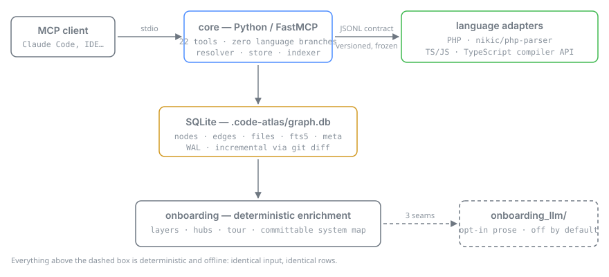

# code-atlas

**An evidence layer for AI coding agents.** A local-first MCP server that indexes your codebase into
a symbol graph, then answers *resolved relationship* questions — who calls this, what implements
that, what breaks if I change this file — as rows, not as files to read.

**PHP · TypeScript/JavaScript · T-SQL · Python.** 24 tools. Deterministic, offline, no LLM in the core.

> ### **~65× fewer tokens** than grep-and-read to reach a resolved answer
> **88–103×** on relation queries. Measured on pinned public repos — 8/8 answers correct, recall
> **1.0**, precision **1.0**, zero confidently-wrong answers.
> [Reproduce it](docs/runbooks/tokens-to-answer.md) · one command, no network.

## The 30-second version

Ask *"who calls `member()`?"* in this repo's own TypeScript adapter.

**`grep` — 26 hits, and it cannot tell you which are calls:**

```console
$ grep -rn 'member' adapters/typescript/src/ | wc -l
26

$ grep -rn 'member' adapters/typescript/src/ | head -3
adapters/typescript/src/qname.js:4:// §4.4 Q1). The root container is the repo-relative posix
adapters/typescript/src/qname.js:12:function member(container, name) {
adapters/typescript/src/types.js:55:  for (const member of classNode.members || []) {
```

A comment, the definition itself, and an unrelated loop variable. The agent has to open and read
every one of the 26 to sort them out. **That reading is the cost**, and it is paid in context.

**code-atlas — 13 call sites, each resolved, with the tier it was resolved at:**

```jsonc
// MCP tool call, not a shell command
find_callers(qname: "adapters/typescript/src/qname.js::member")

reason: "ok"   total_count: 13   truncated: false   depth: 1

RESOLVED  parseFile::collect               adapters/typescript/src/parse.js:216
RESOLVED  parseFile::collect               adapters/typescript/src/parse.js:222
RESOLVED  parseFile::emitBodyEdges         adapters/typescript/src/parse.js:397
RESOLVED  parseFile::emitBodyEdges         adapters/typescript/src/parse.js:410
RESOLVED  parseFile::emitDefaultAlias      adapters/typescript/src/parse.js:326
RESOLVED  parseFile::emitJsDocDeclarations adapters/typescript/src/parse.js:337
…
```

No comment, no definition, no unrelated variable — and `total_count: 13` is the true size of the
answer, not the length of the page you were handed. Building that index took **0.47 s**.

> Real output, reproduced on 2026-08-29 by pointing code-atlas at its own `adapters/typescript/`.

## Why code-atlas

`grep` returns every line containing the string. An LSP answers precisely but one editor buffer at a
time. Neither gives an agent a *countable* answer it can act on, and both make it read files to find
out. code-atlas parses each language with its **best** parser into a **SQLite symbol graph**,
resolves cross-file edges once at index time, and serves callers, implementations, blast radius,
reachability and the path between two symbols as rows.

**Use it if:** you have a large codebase (>10k files) you did not write · an AI agent is doing the
reading, not a human in an IDE · you need the answer to be checkable, not plausible.

**It is not** a faster `grep`, an editor, or a language server — an LSP stays for precise in-buffer
nav, and code-atlas never mutates code. C#/.NET is on the roadmap, not shipped.

## Quick start

You need **Python ≥ 3.12**, plus the runtime of whichever language you want to index: a **PHP CLI ≥
8.1** with **[Composer](https://getcomposer.org/)** for PHP, **Node.js ≥ 18** for TypeScript/JavaScript
and T-SQL. The Python adapter is stdlib-only and runs on the same interpreter as the core.

```bash
git clone https://github.com/cuongdinhngo/code-atlas.git
cd code-atlas
python scripts/setup.py /abs/path/to/your-project
```

That installs the core, builds the PHP adapter, and writes `<your-project>/.mcp.json` with the
correct interpreter, adapter path and working directory filled in — the three things that are easy
to get wrong by hand. Run it with no path to print the snippet instead of writing it.

For TypeScript/JavaScript, T-SQL or Python, add that adapter — the core resolves any `CA_<LANG>_CMD`
generically from the variable name, so each is one env var, not a code change:

```bash
npm ci --prefix adapters/typescript
export CA_TYPESCRIPT_CMD="node /abs/path/to/code-atlas/adapters/typescript/index.js --server"

npm ci --prefix adapters/sql          # dev-only deps; the scanner itself has none
export CA_SQL_CMD="node /abs/path/to/code-atlas/adapters/sql/index.js --server"

# Python adapter — stdlib only; use the same interpreter that runs the core
export CA_PYTHON_CMD="python /abs/path/to/code-atlas/adapters/python/index.py --server"
```

Then **reload your MCP client** (in Claude Code: restart, or re-approve the project's `.mcp.json`)
and call **`get_index_status`** first — it is the cheap (~100-token) entry point that says whether
there is an index, how stale it is, and what to call next. Then `build_or_update_index`, then query.

<details>
<summary>Wiring it by hand, or running the server from a container</summary>

**By hand:** `pip install -e .`, then `composer install --working-dir=adapters/php`, then point an
`.mcp.json` at your repo — `command` = `code-atlas` (or `python -m code_atlas.main`), `cwd` = the
repo to index, `env.CA_PHP_CMD` = `php /abs/path/to/code-atlas/adapters/php/index.php --server`. The
adapter lives in this checkout, so `CA_PHP_CMD` must be an **absolute** path. Details in
[`adapters/php/README.md`](adapters/php/README.md).

**In a container** — no host Python or PHP needed; the image bundles the pinned adapters:

```bash
docker build -f docker/Dockerfile.runtime -t code-atlas-server .
```

```jsonc
// .mcp.json — the server indexes the mounted repo and writes .code-atlas/graph.db into it
{"mcpServers": {"code-atlas": {"command": "docker",
  "args": ["run", "-i", "--rm", "-v", "/abs/path/to/your-project:/workspace", "code-atlas-server"]}}}
```

MCP speaks over stdio, so `-i` is required; the server indexes `/workspace`, so mount the repo
there. Add `"--user", "1000:1000"` to keep `.code-atlas/` writes owned by you. See [`docker/`](docker/).
</details>

Onboarding a **large legacy repo** — where the first build takes minutes and one knob decides
whether the database is 1 GB or 2 GB — is covered step by step in
[`docs/runbooks/onboarding-a-repo.md`](docs/runbooks/onboarding-a-repo.md).

## Architecture



The core is language-agnostic — **no per-language branches, CI-gated**. Adapters parse files and
emit a common `{nodes, edges}` vocabulary; the core stores them, resolves cross-file edges, and
exposes the MCP tools. Everything runs offline against local SQLite, with incremental updates via
`git diff`. Requires **SQLite ≥ 3.25**.

| Language | Parser | Status |
|---|---|---|
| PHP (8.5 grammar, 8.1+ runtime) | nikic/php-parser | **Available** — see [`adapters/php/`](adapters/php/) |
| TypeScript / JavaScript (Node ≥ 18) | TypeScript compiler API | **Available** — see [`adapters/typescript/`](adapters/typescript/) |
| T-SQL (Node ≥ 18) | purpose-built scanner, no production dependencies | **Available** — see [`adapters/sql/`](adapters/sql/) |
| Python (≥ 3.12 grammar) | stdlib `ast` | **Available** — see [`adapters/python/`](adapters/python/) |
| C# / .NET | Roslyn | On the roadmap |

Adding a language touches **no core code** — an adapter announces its own name, the file suffixes it
owns and its capabilities on one handshake line, and the core routes files from that alone.

## What you can ask it

| Question | Tool |
|---|---|
| Who calls this? What implements it? Where is it referenced? | `find_callers` · `find_implementations` · `find_references` |
| What breaks if I change these files? | `impact`, and `impact_modules` for the same radius rolled up to business modules |
| What is dead code here? | `find_orphans` · `reachable_from` |
| How does A reach B? | `explain_path` |
| Show me this symbol, without the rest of the file | `read_symbol` · `file_outline` |
| I did not write this repo — where do I start reading? | `architecture_overview` · `guided_tour` · `generate_onboarding` |
| Are any of these ten names already taken? | `search_symbol` with a list of `queries` — one call, not ten |
| Did this change break an architectural rule? | `check_architecture_rules` · `diff_architecture` |
| What happens when a user does X — entry to data? | `trace_capability`, one entry, file or module per call |
| Draw me this type and its ancestry | `class_diagram` |
| Which writers of this table omit a defaulted column? | `check_column_defaults` (T-SQL) |

**All 24 tools, what each returns, and which take a list of subjects: [`docs/TOOLS.md`](docs/TOOLS.md).**

### Three properties worth knowing before you install

**Every answer says what it is not telling you.** `total_count` (the true size, not the page),
`truncated`, `limit_capped_to`, and `reason` on every empty result — `no_such_symbol`,
`name_not_qualified`, `not_indexed`, `relationship_not_modelled`, `capability_not_configured`. **An
empty result is never an unexplained zero**, and where a better route exists the payload names a
real, callable tool in `try_instead`. This is what makes an agent's answer auditable instead of
merely confident.

**Every edge carries a confidence tier** — `RESOLVED`, `HEURISTIC` or `DYNAMIC`. A guess is never
linked as a fact, and an answer whose candidates are all dynamic says so with `authoritative: false`.

**An answer can be signed.** Pass `sign: true` to five tools and the payload gains a one-line
`claim` you can paste into a PR body — a claim a text search cannot make, in a form a reviewer can
re-run. Off by default, +51 tokens when on.

Full detail: [`docs/design/payload.md`](docs/design/payload.md) ·
[`docs/design/impact-and-claims.md`](docs/design/impact-and-claims.md).

## Measured, not asserted

Every number here is reproducible from a runbook in this repo.

| What | Result | Where |
|---|---|---|
| Tokens to reach a resolved answer, vs grep-and-read | **~65× cheaper** on pinned public PHP repos (laravel · symfony · brick) — 8/8 correct, recall 1.0, precision 1.0; **88–103×** on relation queries. Re-measured 2026-09-06 | [`tokens-to-answer.md`](docs/runbooks/tokens-to-answer.md) |
| Answer correctness, blind field round | **8 of 8 checked claims exact, zero false statements** | §19 |
| Cost of the *n*-th parallel agent | **~70 MB PSS**; the 925 MB index costs **0 MB** (page-cached, never mmapped) | [`parallel-agents.md`](docs/runbooks/parallel-agents.md) |
| Five agents vs one | **4.3× throughput**, 1.3 % of RAM, zero `SQLITE_BUSY` reaching a caller | same |
| Incremental no-op rebuild | **56.1 s → 2.113 s (26×)**, two no-ops byte-identical | §19 |
| Onboarding lookups vs hand-mapping | **cheaper, 12/12 correct, recall 1.0** | [`121_onboarding-question-class.md`](docs/benchmarks/121_onboarding-question-class.md) |

**Row two is the one the design optimises for.** Every failure in that round was *silence or
ambiguity* — never a wrong answer. A tool an agent cannot trust to be wrong-free is a tool whose
every answer must be re-verified by hand, which costs more than not having it.

## Configuration

Every knob resolves **environment → project file → default**. The project file is
`.code-atlas.toml` at the repo root (optional, meant to be committed); its keys are the environment
names lower-cased without the `CA_` prefix. A malformed value or an unknown key is a loud error,
never a silent fallback.

| Environment | `.code-atlas.toml` | Default | Meaning |
|---|---|---|---|
| `CA_DB_PATH` | `db_path` | `.code-atlas/graph.db` | index location (relative to the repo root) |
| `CA_WORKERS` | `workers` | `max(1, min(cpu-2, 8))` | adapter processes during a build |
| `CA_MAX_RESULTS` | `max_results` | `50` | result cap for search/nav tools — **and** the resolver's per-call-site candidate fan-out, which sets index size |
| `CA_IMPACT_DEPTH` / `CA_IMPACT_MAX_NODES` | `impact_depth` / `impact_max_nodes` | `2` / `500` | hops and node budget for one impact query |
| `CA_ENTRY_POINTS` | `entry_points` | unset | file globs that seed reachability. **`reachable_from` and `find_orphans` need this** — unset, they report *no roots configured* rather than guessing |
| `CA_STUB_ROOTS` | `stub_roots` | unset | dependency roots (e.g. `vendor`) to index declarations-only, so third-party signatures resolve |
| `CA_INDIRECTION_RULES` | `indirection_rules` | unset | JSON rule files mapping framework indirection to edges. **`find_view_data` needs this** |
| `CA_ARCHITECTURE_RULES` | `architecture_rules` | unset | JSON rule files of path-set dependency constraints. **`check_architecture_rules` needs this** |
| `CA_<LANG>_CMD` | `[adapter_cmd].<lang>` | — | the **complete argv** that launches one adapter in server mode |

```toml
# .code-atlas.toml
workers = 4
max_results = 50

[adapter_cmd]
php = "docker compose exec -T php php /app/adapters/php/index.php --server"
typescript = "node /abs/path/to/code-atlas/adapters/typescript/index.js --server"
sql = "node /abs/path/to/code-atlas/adapters/sql/index.js --server"
python = "python /abs/path/to/code-atlas/adapters/python/index.py --server"
```

The adapter command is the **whole** command: the core appends nothing to it, not even `--server`,
so it never has to know where a language's adapter lives.

Files are skipped using built-in patterns (`vendor/ var/ uploads/ log/ node_modules/ .git/
*.blade.*`), then `.gitignore`, then an optional `.codeatlasignore` — later rules win. The full
knob table, including the LLM-enrichment switches, is in
[`docs/TOOLS.md`](docs/TOOLS.md#configuration-reference).

**Optional LLM enrichment (off by default).** The onboarding tools are fully deterministic — no LLM,
no network. An opt-in package, [`onboarding_llm/`](onboarding_llm/README.md), plugs into three seams
to reword module summaries, weak layer names and the map's prose. Structure is never the seam's to
change: every count, ranking and grouping is derived before a model is consulted, and the core never
imports it.

## Testing

`scripts/gate.sh` runs the whole gate in one step — bytecode invalidation, entry points, `ruff`,
`mypy`, `pytest`, the tokens-to-answer benchmark, `composer validate`, `php -l`, phpstan at level
max, and the four rulebook grep-gates — in the same order
[`ci.yml`](.github/workflows/ci.yml) runs them. It exits non-zero if a check **failed or was
skipped**, because a gate that quietly shrinks to whatever the host can run has not verified
anything. Add `--fast` to skip the two slow checks.

**2,972 tests, 0 skipped** on a POSIX host with every adapter installed. To run everything off any
host (Windows/macOS included), use the Linux test image — it reports one structural skip, the test
that shells out to `docker`:

```sh
scripts/docker-test.sh                       # ruff + mypy + pytest -q (the full suite)
scripts/docker-test.sh pytest -q -k php      # just the PHP-adapter integration tests
```

Contributors: the per-route expected counts and what a legitimate skip looks like are in
[`AGENTS.md`](AGENTS.md).

## Documentation

| Doc | Answers |
|---|---|
| [`docs/TOOLS.md`](docs/TOOLS.md) | all 24 tools, the operator prompts, the opt-in hooks, and which tools take a list of subjects |
| [`docs/design/`](docs/design/) | why an answer is shaped the way it is — [payload](docs/design/payload.md) · [indexing & search](docs/design/indexing.md) · [impact & claims](docs/design/impact-and-claims.md) |
| [`docs/PLAN.md`](docs/PLAN.md) | the authoritative design, and **§19** — the decision log: what was measured, what was refuted |
| [`docs/CONVENTION.md`](docs/CONVENTION.md) | naming, repo layout, and **§6** — the payload contract every tool answer obeys |
| [`docs/ENGINEERING_RULES.md`](docs/ENGINEERING_RULES.md) | the binding *how we build* rules, several CI-gated |

**Runbooks** — operator protocols, each reproducible:
[onboarding a large legacy repo](docs/runbooks/onboarding-a-repo.md) ·
[tokens-to-answer](docs/runbooks/tokens-to-answer.md) ·
[parallel agents](docs/runbooks/parallel-agents.md) ·
[cross-repo validation](docs/runbooks/cross-repo-validation.md) ·
[field retro](docs/runbooks/field-retro.md) ·
[tool-recognition probe](docs/runbooks/tool-recognition-probe.md).

Contributing agents should start at [`AGENTS.md`](AGENTS.md).

## Roadmap

- **Core + PHP — shipped.** Full build → resolver → search/read/outline → scale → incremental → impact.
- **Onboarding — shipped.** `architecture_overview`, `guided_tour` and `generate_onboarding` emit a
  committable **system map** under `docs/onboarding/`: responsibility layers, dependency matrix,
  hubs, a business-module table, mirror-subtree lookup, a bounded tour, and the zero-inbound
  population split.
- **More languages — TS/JS, T-SQL and Python shipped.** The second adapter was the contract's real
  test and it passed **without a version bump** and without a line of core code — still one seam, no
  registry. C#/.NET is next.

**Design principles.** SOLID **at the boundaries** (the axis of change is *languages*, expressed
through one versioned contract) + **YAGNI** (one seam only) + **standard over sample** (adapters
encode the language spec/standards, never a specific repo's conventions). Details in the
[build plan](docs/PLAN.md).

## License

MIT — see [`LICENSE`](LICENSE). © 2026 Cuong Ngo.
