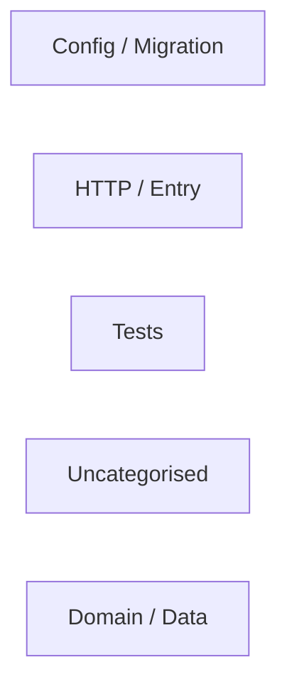
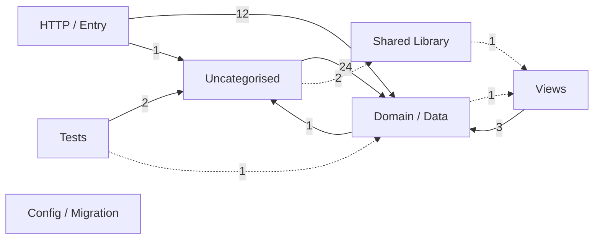
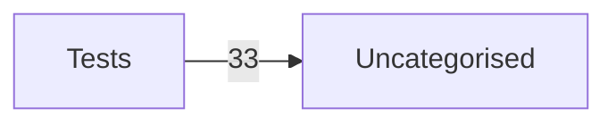

# 143 — layer graphs of the pinned public repos

Generated from `scripts/layer_diagram_report.py` against `scripts/cross_repo_samples.json`. HEURISTIC-only arrows are dashed.

## `laravel/laravel` @ `ff031db`

- layers: 5 shown of 5
- DYNAMIC-only crossings omitted: 1

## `symfony/demo` @ `03fe256`

- layers: 7 shown of 7
- DYNAMIC-only crossings omitted: 13

## `brick/math` @ `b61d8e6`

- layers: 2 shown of 2
- DYNAMIC-only crossings omitted: 26

